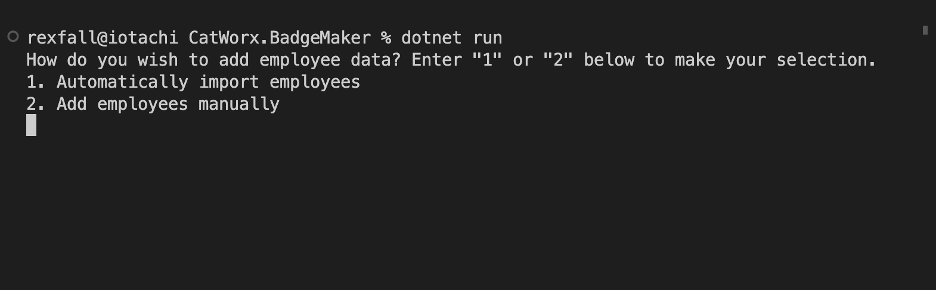
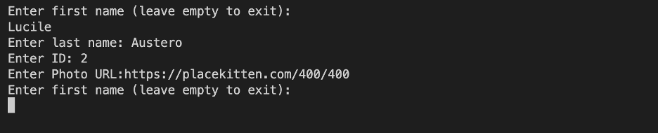

# CatWorx Badgemaker 

## Technology Used 

| Technology Used |                                                                       Resource URL                                                                       |
| --------------- | :------------------------------------------------------------------------------------------------------------------------------------------------------: |
| C#              |            [https://learn.microsoft.com/en-us/dotnet/csharp/tour-of-csharp/](https://learn.microsoft.com/en-us/dotnet/csharp/tour-of-csharp/)            |
| .NET            |             [https://dotnet.microsoft.com/en-us/learn/dotnet/what-is-dotnet](https://dotnet.microsoft.com/en-us/learn/dotnet/what-is-dotnet)             |
| SkiaSharp       | [https://learn.microsoft.com/en-us/dotnet/api/SkiaSharp?view=skiasharp-2.88](https://learn.microsoft.com/en-us/dotnet/api/SkiaSharp?view=skiasharp-2.88) |
| Json.NET        |                                            [https://www.newtonsoft.com/json](https://www.newtonsoft.com/json)                                            |

<br/>

## Description 

[Watch the Walk-Through Video](https://drive.google.com/file/d/1-nPDNNswVXW17SjJmQRwMJKwN2Mfah2t/view?usp=sharing)

<br/>

This command line application generates employee ID badges. The user has the option to import employee data automatically or enter data manually. The application then persists the data to a .csv file and generates an image of an ID badge for each employee. 

<br/>



<br/>

## Code Example

I completed this project in the C# continuation course (post-work) for the UC Berkeley Coding Boot Camp. Starter code was provided, but I wrote the following code within the ```MakeBadges()``` method to add the text and photo to the badge background. 


```C++
canvas.DrawText(employees[i].GetCompanyName(), BADGE_WIDTH / 2f, COMPANY_NAME_Y, paint);

paint.Color = SKColors.Black;

canvas.DrawText(employees[i].GetFullName(), BADGE_WIDTH / 2f, EMPLOYEE_NAME_Y, paint);

paint.Typeface = SKTypeface.FromFamilyName("Courier New");

canvas.DrawText(employees[i].GetId().ToString(), BADGE_WIDTH / 2f, EMPLOYEE_ID_Y, paint);

SKImage finalImage = SKImage.FromBitmap(badge);
SKData data = finalImage.Encode();
data.SaveTo(File.OpenWrite("data/employeeBadge" + employees[i].GetId().ToString() + ".png"));
```

As another example, I wrote the ```Main()``` method below. 

```c#
async static Task Main(string[] args)
{
    List<Employee> employees = new List<Employee>();
    string selection = "";
    Console.WriteLine($"How do you wish to add employee data? Enter \"1\" or \"2\" below to make your selection.");

    while (selection != "1" && selection != "2")
    {
        if (selection != "")
        {
            Console.WriteLine("Invalid selection. Enter \"1\" or \"2\" below to make your selection.");
        }
        Console.WriteLine("1. Automatically import employees");
        Console.WriteLine("2. Add employees manually");
        selection = Console.ReadLine() ?? "";
        }

    switch (selection)
    {
        case "1":
            employees = await PeopleFetcher.GetFromApi();
            break;
        case "2":
            employees = PeopleFetcher.GetEmployees();
            break;
        default:
            Console.WriteLine("Oops! Something went wrong");
            break;
    }

    Util.PrintEmployees(employees);
    Util.MakeCSV(employees);
    await Util.MakeBadges(employees);
}
```

<br/>

## Usage 
### Installation

1. Open the ```<> Code``` menu in this GitHub repository.
2. Select ```Download ZIP```.
3. Unzip the folder in the desired location.
4. Navigate to the unzipped folder in your terminal.
5. [Install .NET on your computer](https://dotnet.microsoft.com/en-us/download), if you don't already have it.

<br/>

### Usage

1. Run the terminal command ```dotnet run``` in the root directory to launch the application.
2. Enter ```1``` to import employee data or ```2``` to enter data manually.
3. If you choose to enter data, a series of prompts will ask you for each employee's first name, last name, ID number, and photo URL (see below). After entering all employee data, press the ```Enter``` key when prompted to enter a first name.

<br/>



<br/>

4. The application automatically creates a data directory if none exists, saves the employee data in a .csv file in that directory, and saves an image of the employee ID badge for each employee in that directory.

<br/>

## Learning Points 

By completing this project, I learned C# and .NET. Seeing how C# handles JSON was a real eye-opener. It took a few attempts before I could successfully iterate over the "objects" (C# doesn't have a data structure that works quite like objects in JavaScript) in an array.

<br/>

## Author Info

### Ryan Moscoe 

* [Portfolio](https://rmoscoe.github.io/my-portfolio/)
* [LinkedIn](https://www.linkedin.com/in/ryan-moscoe-8652973/)
* [Github](https://github.com/rmoscoe)

<br/>

## Credits

Starter code provided by Trilogy Education Services, LLC, a 2U, Inc. brand, in conjunction with the University of California, Berkeley.

<br/>

## License

See repository for license information.